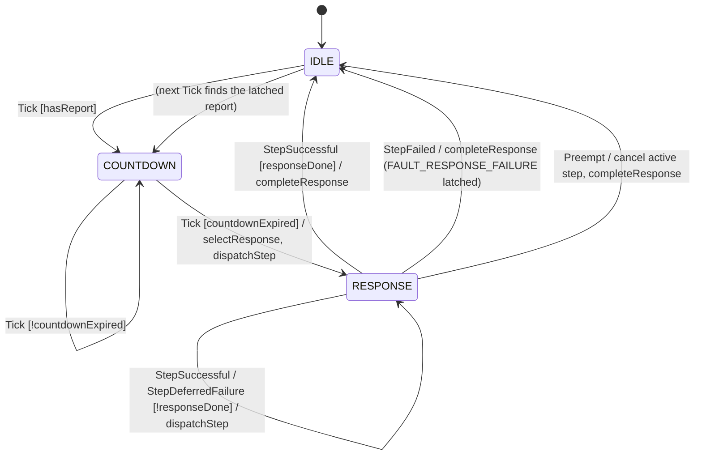

# Svc::FaultProtection::FaultManager

Translates incoming fault reports into a series of fault response step dispatches.

## 1. Requirements

| ID                   | Description (shall)                                                                                                                                       | Verification |
| -------------------- | --------------------------------------------------------------------------------------------------------------------------------------------------------- | ------------ |
| SVC_FAULTMANAGER_001 | FaultManager shall have a synchronous fault report input port carrying a project-configured `FaultConfig.Fault` enumeration value identifying the fault.  | Unit-Test    |
| SVC_FAULTMANAGER_002 | FaultManager shall map each fault to a response and each response to an ordered list of steps per the project `FaultConfig` tables.                       | Unit-Test    |
| SVC_FAULTMANAGER_003 | FaultManager shall accept the fault response, response definition, and step definition tables as parameters defaulting to the `FaultConfig` tables.      | Unit-Test    |
| SVC_FAULTMANAGER_004 | Upon selecting a response, FaultManager shall dispatch its steps sequentially, dispatching each step after the completion of the previous step.            | Unit-Test    |
| SVC_FAULTMANAGER_005 | For each step, FaultManager shall dispatch to the step's configured port passing the response, step, and project-configured context.                       | Unit-Test    |
| SVC_FAULTMANAGER_006 | FaultManager shall validate fault, response, and step values from ports and commands against the configured enumerations, rejecting out-of-range values.  | Unit-Test    |
| SVC_FAULTMANAGER_007 | FaultManager shall require the project's `FaultConfig.Fault` enumeration to define `FAULT_RESPONSE_FAILURE` reserved for FaultManager's own fault.        | Unit-Test    |
| SVC_FAULTMANAGER_008 | If a step fails with failure mode `FAULT`, FaultManager shall cease the response and report `FAULT_RESPONSE_FAILURE`. Mode `DEFER` continues the steps and reports after the response; mode `IGNORE` continues the steps and reports nothing. | Unit-Test |
| SVC_FAULTMANAGER_009 | FaultManager shall provide a command to enable/disable each fault.                                                                                        | Unit-Test    |
| SVC_FAULTMANAGER_010 | FaultManager shall latch each reported fault until its response starts; further reports of a latched fault shall be ignored.                              | Unit-Test    |
| SVC_FAULTMANAGER_011 | FaultManager shall provide a command to enable/disable each response.                                                                                      | Unit-Test    |
| SVC_FAULTMANAGER_012 | FaultManager shall provide a command to set the failure mode of each step.                                                                                 | Unit-Test    |
| SVC_FAULTMANAGER_013 | FaultManager shall wait `FaultConfig.RESPONSE_COUNTDOWN_TICKS` ticks after the first latched report, then respond to the highest-precedence latched fault. | Unit-Test    |
| SVC_FAULTMANAGER_014 | FaultManager shall ignore (take no action on) a reported fault that is disabled.                                                                           | Unit-Test    |
| SVC_FAULTMANAGER_015 | FaultManager shall skip every step of a disabled response, emitting an event per skipped step, and complete the response.                                  | Unit-Test    |
| SVC_FAULTMANAGER_016 | FaultManager shall preempt an active response when a fault of higher precedence than the fault under response is reported, cancelling the active step.    | Unit-Test    |
| SVC_FAULTMANAGER_017 | FaultManager shall not report `FAULT_RESPONSE_FAILURE` in response to a failure of the `FAULT_RESPONSE_FAILURE` response itself.                            | Unit-Test    |
| SVC_FAULTMANAGER_018 | FaultManager shall not assert (FATAL) on any port or command input: all inputs are validated and overflow is handled by dropping.                           | Unit-Test    |
| SVC_FAULTMANAGER_019 | FaultManager shall report telemetry counting faults reported, faults ignored, responses completed, and responses failed.                                   | Unit-Test    |

## 2. Design

`Svc.FaultProtection.FaultManager` is an `active` component driven by a `run` port on a rate group. Fault reports
arrive synchronously on `reportIn` and are latched in an atomic per-fault flag, so a report is never lost to queue
state. Each `run` tick advances the `FaultManagerStateMachine`:

1. **IDLE**: each tick checks for a latched report.
2. **COUNTDOWN**: `FaultConfig.RESPONSE_COUNTDOWN_TICKS` ticks allow further reports to accumulate.
3. **RESPONSE**: the enabled fault of highest precedence is selected; its latch is cleared; the response's steps are
   dispatched in order on `stepDispatchOut[<step port>]`. A completion on `stepCompletionIn` for the active step
   advances to the next step. `SKIP` steps and the steps of a disabled response are skipped with `StepSkipped`.
4. A failed step is handled per its `FailureMode`: `IGNORE` continues; `DEFER` continues and fails the response at
   its end; `FAULT` fails the response immediately. A failed response reports `FAULT_RESPONSE_FAILURE` internally,
   unless the failed response was itself the response to `FAULT_RESPONSE_FAILURE`.
5. A report of a fault with higher precedence than the fault under response preempts the response: `stepCancelOut`
   is sent to the active step's port and `ResponsePreempted` is emitted. The preempted fault stays latched and is
   responded to after the preempting fault.

Completions for a step other than the active one are logged (`UnexpectedStepCompleted`) and ignored. Unconnected
step ports are treated as step failures (`StepPortUnconnected`).

`FaultReported` is bounded by latching (one per fault per response) and is not throttled. The events for reports
that are not acted on (`FaultIgnored`, `FaultDisabled`, `FaultInvalid`) are throttled, and the throttle is cleared on
every `run` tick: a reporter flapping faster than the rate group is bounded to a few events per tick without being
silenced for the remainder of the mission.

### 2.1 Ports

| Name               | Kind                  | Type                      | Description                                                      |
| ------------------ | --------------------- | ------------------------- | ---------------------------------------------------------------- |
| `run`              | `async input` (drop)  | `Svc.Sched`               | Rate group tick driving the state machine                        |
| `reportIn`         | `sync input`          | `FaultReport`             | Fault report; latched synchronously                              |
| `stepDispatchOut`  | `output [NUM_PORTS]`  | `FaultResponseDispatch`   | Step dispatch, one port per `FaultConfig.Port`                   |
| `stepCancelOut`    | `output [NUM_PORTS]`  | `Fw.Signal`               | Step cancellation, one port per `FaultConfig.Port`               |
| `stepCompletionIn` | `async input` (drop)  | `FaultResponseComplete`   | Step completion status from a responder                          |

### 2.2 Commands

| Name                       | Description                                                                 |
| -------------------------- | --------------------------------------------------------------------------- |
| `SET_FAULT_ENABLED`        | Enable/disable response to a fault (updates `FAULT_RESPONSE_TABLE`)          |
| `SET_RESPONSE_ENABLED`     | Enable/disable a response (updates `RESPONSE_TABLE`)                      |
| `UPDATE_STEP_FAILURE_MODE` | Set the failure mode of a step (updates `STEP_TABLE`)                        |

Out-of-range enumeration values (e.g. `NUM_FAULTS`) respond `VALIDATION_ERROR` with `InvalidCommandArgument`.

### 2.3 Telemetry

| Name                 | Description                       |
| -------------------- | --------------------------------- |
| `FaultsReported`     | Reports accepted and latched      |
| `FaultsIgnored`      | Reports ignored (latched/disabled/invalid) |
| `ResponsesCompleted` | Responses completed successfully  |
| `ResponsesFailed`    | Responses completed with failure  |

## 3. Configuration

`Svc.FaultProtection.FaultManager` is project-configurable through the `FaultConfig` FPP module, which the project
overrides in its configuration directory (see `Svc/FaultProtection/FaultConfig/FaultConfig.fpp` for the framework
default and `TestDeploymentsProject/Ref/Config/FaultConfig.fpp` for an example override).

| Item                        | Description                                                                              |
| --------------------------- | ---------------------------------------------------------------------------------------- |
| `FAULT_RESPONSE_STEP_COUNT` | Steps per response; unused steps are `SKIP`                                              |
| `RESPONSE_COUNTDOWN_TICKS`  | Ticks between the first report and the response                                          |
| `Fault`                     | Faults; `FATAL_OCCURRED` and `FAULT_RESPONSE_FAILURE` are required, `NUM_FAULTS` last     |
| `Response`                  | Responses; `NUM_RESPONSES` last                                                          |
| `Step`                      | Steps; `NUM_STEPS` penultimate and `SKIP` last                                           |
| `Port`                      | Dispatch ports; `NUM_PORTS` last                                                         |
| `Context`                   | Project-defined structure forwarded with each dispatch                                   |
| `FaultResponseTable`        | One `FaultResponseEntry` (precedence, response, enabled) per fault                       |
| `ResponseDefinitionTable`   | One `ResponseDefinitionEntry` (steps) per response                                       |
| `StepDefinitionTable`       | One `StepDefinitionEntry` (failure mode, port, context) per step except `SKIP`           |

The tables are loaded at construction and may be overridden by the `FAULT_RESPONSE_TABLE`, `RESPONSE_TABLE`, and
`STEP_TABLE` parameters when those are valid in the parameter database. The `Svc.FaultProtection.Subtopology`
instantiates the FaultManager with a `SequenceResponder` and a `RebootResponder` and exposes `reportIn`,
`faultManagerRun`, and the sequencer ports for the deployment to connect.
