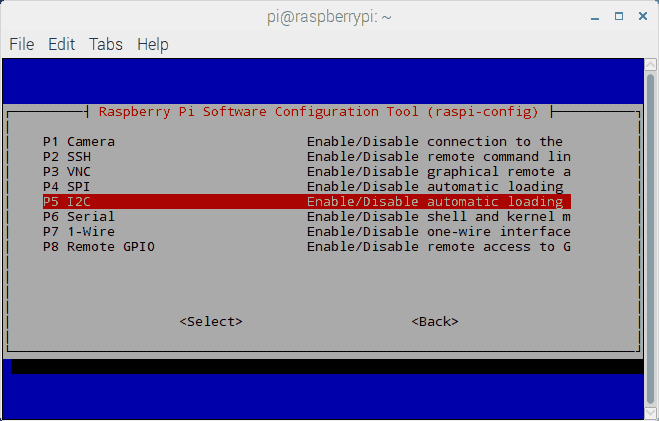
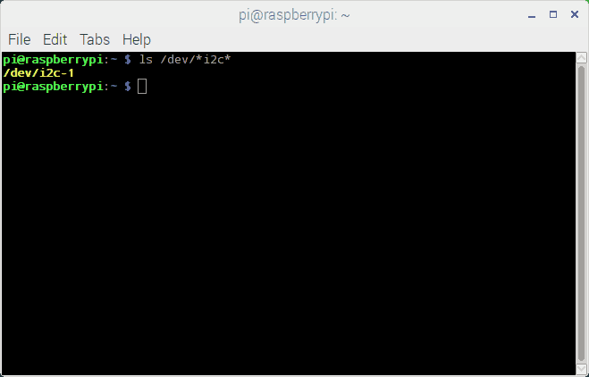

# F´ I2C Tutorial


**Note to F’ Author and Moderators**
Thank you for helping me out with technical issues over the past few months. You guys have done superb jobs at keeping this framework well maintained. Having such an active community is why I choose F’ over something else for flight control software. I want to help you guys out so I come up with this. This guide comes from a newbie perspective with roughly a month and a half on F’. I don’t have a strong CS background so my code might not be really efficient or my wording here might not be spot on. Feel free to let me know what I got wrong or improvements that can be made. I don’t plan to do SPI and GPIO since we already have RPIdemo for that but if you guys think it’s a good idea to have someone working on that too then I can chip in as well. Also, English is not my first language so bear with me here.

The following example shows how to utilize an I2C driver to write commands to and receive sensor data from ADXL 345 accelerometer as a slave with a Raspberry pi as a master. This project is written and cross-compiled from ubuntu 18.04 to Raspberry pi 3 B+ but it should work with any raspberry pi or any linux based single board computer that supports I2C interface.


## Prerequisites

It is recommended that you have reviewed [INSTALL.md](../../INSTALL.md), [Getting Started Tutorial](../GettingStarted/Tutorial.md), [Math Component Tutorial](../MathComponent/Tutorial.md), [RPI demo](../../../RPI/README.md), and [GPS tutorial](../GpsTutorial/Tutorial.md) beforehand as these guides provide a basic understanding of F’ and its functionality.


## Hardware Set up

Before everything, we need to make sure that the I2C interface is enabled on our raspberry pi. This can be done by using raspi-config > interfaces option > I2C



To verify that I2C is enabled, run this command on the Raspberry Pi terminal
```shell
sudo ls /dev/*i2c*
```
If the accelerometer is properly connected, you should see something like this.



ADXL 345 is a simple accelerometer that usually comes with an Arduino starter kit. It can run on both 5V and 3.3V but in this tutorial, we are going to use it on 3.3V. The wiring diagram is shown below. 


Basically, connect 
- 3.3V pin on adxl 345 to R Pi pin 1
- SDA pin on adxl 345 to R Pi pin 3
- SCL pin on adxl 345 to R Pi pin 5
- GND pin on adxl 345 to R Pi pin 6.

The default slave address of the accelerometer is 0x53. Once you have connected all the wires, you can verify the address by installing and using i2cdetect. If you don’t have this tool installed then
```shell
sudo apt-get install i2c-tools
```

To check the address of a slave device on i2c - 1
```shell
i2cdetect -y 1
```
If your accelerometer is powered and connected to R pi, it should show something like this 


### Designing the Accelerometer Component

We are going to make an accelerometer as a passive component. It won’t have any commands or events but it will provide accelerometer sensor reading on the X Y and Z axes. We are also going to use ports provided by LinuxI2Cdriver for reading and writing. To begin, we are going to create an empty folder in fprime directory called AccelApp. Inside, we are going to create two new folders; Accel and Top. Accel is our component and Top is for topology. Lastly, we will need CMakeLists.txt in AccelApp folder as well.

##Component Design

In Accel folder, we are going to create a new xml file called AccelComponentAi.xml.

```xml
<?xml version="1.0" encoding="UTF-8"?>
<?xml-model href="../../Autocoders/Python/schema/ISF/component_schema.rng" type="application/xml" schematypens="http://relaxng.org/ns/structure/1.0"?>

<component name="Accel" kind="passive" namespace="AccelApp" modeler="true">
    <!-- Standard Ports -->
    <import_port_type>Fw/Time/TimePortAi.xml</import_port_type>
    <import_port_type>Fw/Tlm/TlmPortAi.xml</import_port_type>
    <!-- Scheduled Ports -->
    <import_port_type>Svc/Sched/SchedPortAi.xml</import_port_type>
    <!-- I2c Driver Ports -->
    <import_port_type>Drv/I2cDriverPorts/I2cPortAi.xml</import_port_type>
    <import_port_type>Drv/I2cDriverPorts/I2cWriteReadPortAi.xml</import_port_type>
    <!-- Dictionary Definitions -->
    <import_enum_type>Drv/I2cDriverPorts/I2cStatusEnumAi.xml</import_enum_type>

    <ports>
        <!-- Time port for timestamps in Telemetry -->
        <port name="timeCaller" data_type="Fw::Time"  kind="output" role="TimeGet"    max_number="1">
        </port>
        <!-- Channel telemetry -->
        <port name="tlmOut" data_type="Fw::Tlm"  kind="output" role="Telemetry"    max_number="1">
        </port>
        <!-- I2c ports-->
        <port name="I2cWrite" data_type="Drv::I2c"  kind="output"     max_number="1">
        </port>
        <port name="I2cRead" data_type="Drv::I2c"  kind="output"     max_number="1">
        </port>
        <port name="I2cWriteRead" data_type="Drv::I2cWriteRead"  kind="output"     max_number="1">
        </port>
        <!-- scheduled ports -->
        <port name="SchedIn" data_type="Sched" kind="sync_input" max_number="1">
        </port>
    </ports>

  <telemetry>
    <channel id="0" name="Accel_X" data_type="F32" format_string = "%f" abbrev="Acc-1">
      <comment>Accelerometer X axis value</comment>
    </channel>
    <channel id="1" name="Accel_Y" data_type="F32" format_string = "%f" abbrev="Acc-2">
      <comment>Accelerometer Y axis value</comment>
    </channel>
    <channel id="2" name="Accel_Z" data_type="F32" format_string = "%f" abbrev="Acc-3">
      <comment>Accelerometer Z axis value</comment>
    </channel>
    <channel id="3" name="I2C_BwrateStatus" data_type="Drv::I2cStatus" abbrev="Acc-4">
      <comment>I2c write status for data transfer rate setup</comment>
    </channel>
    <channel id="4" name="I2C_PwrStatus" data_type="Drv::I2cStatus" abbrev="Acc-5">
      <comment>I2c write status for power setup </comment>
    </channel>
    <channel id="5" name="I2C_FormatStatus" data_type="Drv::I2cStatus" abbrev="Acc-6">
      <comment>I2c write status for format setup </comment>
    </channel>
    <channel id="6" name="I2C_Write" data_type="Drv::I2cStatus" abbrev="Acc-7">
      <comment>I2c write status for writing to the register to read accelerometer sensor data</comment>
    </channel>
    <channel id="7" name="I2C_Read" data_type="Drv::I2cStatus" abbrev="Acc-8">
      <comment>I2c read status for reading the sensor data</comment>
    </channel>
  </telemetry>
</component>

```
There are few things to point out here. We are importing I2C ports and I2C WriteRead ports. I2C is synchronous, which means we could write and read at the same time. We are also importing I2Cstatus enum to handle the telemetry that will show whether the data is read or written to/from the device successfully. Since we don’t have any events or commands, all we need for standard ports are just timeCaller and tlmOut for time and telemetry respectively. Lastly, since a passive device has no thread, we will need a schedIn port to connect it to a rategroup so that our component can run on the rategroup thread.

After this, create a CMakeLists.txt in Accel folder and edit it so it looks like this.

```
####
# F prime CMakeLists.txt:
#
# SOURCE_FILES: combined list of source and autocoding diles
# MOD_DEPS: (optional) module dependencies
#
####
set(SOURCE_FILES
    "${CMAKE_CURRENT_LIST_DIR}/AccelComponentAi.xml"
)
register_fprime_module()
```
Go back to AccelApp directory and edit CMakelists.txt so it looks like this.

```
####
# 'AccelApp' Deployment:
#
# This sets up the build for the 'AccelApp' template, including the custom reference
# components. In addition, it imports FPrime.cmake, which includes the core F Prime
# components.
#
# This file has several sections.
#
# 1. Header Section: define basic properties of the build
# 2. F prime core: includes all F prime core components, and build-system properties
# 3. Local subdirectories: contains all deployment specific directory additions
####

##
# Section 1: Basic Project Setup
#
# This contains the basic project information. Specifically, a cmake version and
# project definition.
##
project(AccelApp C CXX)
cmake_minimum_required(VERSION 3.5) # Mimimum 3.5
set(FPRIME_FRAMEWORK_PATH "${CMAKE_CURRENT_LIST_DIR}/.." CACHE PATH "Location of F prime framework" FORCE)
set(FPRIME_PROJECT_ROOT "${CMAKE_CURRENT_LIST_DIR}/.." CACHE PATH "Root path of F prime project" FORCE)

##
# Section 2: F prime Core
#
# This includes all of the F prime core components, and imports the make-system. F prime core
# components will be placed in the F-Prime binary subdirectory to keep them from
# colliding with deployment specific items.
##
include("${CMAKE_CURRENT_LIST_DIR}/../cmake/FPrime.cmake")
# NOTE: register custom targets between these two lines
include("${CMAKE_CURRENT_LIST_DIR}/../cmake/FPrime-Code.cmake")
##
# Section 3: Components and Topology
#
# This section includes deployment specific directories. This allows use of non-
# core components in the topology, which is also added here.
##
# Add component subdirectories


add_fprime_subdirectory("${CMAKE_CURRENT_LIST_DIR}/Accel/")


#Add topology subdirectories

```

In the terminal, activate fprime virtual environment, then head to AccelApp directory and run
```shell
fprime-util generate
```

##Implementation


Head into the Accel folder and run
```shell
fprime-util impl
```
Like what we did in math component tutorial, this creates two templates,
- AccelComponentImpl.cpp-template
- AccelComponentImpl.hpp-template
Rename the file to remove the “-template” out of the file extension.

Edit the AccelComponentImpl.cpp so it looks like this.

```cpp
// ======================================================================
// \title  AccelComponentImpl.cpp
// \author rpk
// \brief  cpp file for Accel component implementation class
//
// \copyright
// Copyright 2009-2015, by the California Institute of Technology.
// ALL RIGHTS RESERVED.  United States Government Sponsorship
// acknowledged.
//
// ======================================================================


#include <AccelApp/Accel/AccelComponentImpl.hpp>
#include "Fw/Types/BasicTypes.hpp"

#define addr 0x53 //define the ADXL 345 I2C address

namespace AccelApp {

  // ----------------------------------------------------------------------
  // Construction, initialization, and destruction
  // ----------------------------------------------------------------------

  AccelComponentImpl ::
    AccelComponentImpl(
        const char *const compName
    ) : AccelComponentBase(compName)
  {

  }

  void AccelComponentImpl ::
    init(
        const NATIVE_INT_TYPE instance
    )
  {
    AccelComponentBase::init(instance);
  }
  


  AccelComponentImpl ::
    ~AccelComponentImpl(void)
  {

  }

  // ----------------------------------------------------------------------
  // Handler implementations for user-defined typed input ports
  // ----------------------------------------------------------------------

  void AccelComponentImpl ::
    SchedIn_handler(
        const NATIVE_INT_TYPE portNum,
        NATIVE_UINT_TYPE context
    )
  {
    //To do: I2CTutorial
    //set up BW rate, power control, data format based on ADXL 345 datasheet
  
    Fw::Buffer BwRateSetup;
    Fw::Buffer PwrSetup;
    Fw::Buffer FormatSetup;
    unsigned char BwConfig[2];
    unsigned char PwrConfig[2];
    unsigned char FormatConfig[2];
    Drv::I2cStatus i2cStatusBwrate;
    Drv::I2cStatus i2cStatusPwr;
    Drv::I2cStatus i2cStatusFormat;


    BwConfig[0] = 0x2C; //BW register
    BwConfig[1] = 0x0B; //BW set value
    PwrConfig[0] = 0x2D; //Power register
    PwrConfig[1] = 0x08; //Power value
    FormatConfig[0] = 0x31; //Power register
    FormatConfig[1] = 0x0B; //Power value

    BwRateSetup.setSize(2); //set buffer size
    BwRateSetup.setData((U8*)BwConfig); //set data to our buffer

    PwrSetup.setSize(2); //set buffer size
    PwrSetup.setData((U8*)PwrConfig); //set data to our buffer

    FormatSetup.setSize(2); //set buffer size
    FormatSetup.setData((U8*)FormatConfig); //set data to our buffer

    //Write to ADXL345 to set up the device
    i2cStatusBwrate = I2cWrite_out(0,addr,BwRateSetup);
    i2cStatusPwr = I2cWrite_out(0,addr,PwrSetup);
    i2cStatusFormat = I2cWrite_out(0,addr,FormatSetup);

    //Write the status of the writing process to telemetry
    this->tlmWrite_I2C_BwrateStatus(i2cStatusBwrate);
    this->tlmWrite_I2C_PwrStatus(i2cStatusPwr);
    this->tlmWrite_I2C_FormatStatus(i2cStatusFormat);

    //get the sensor reading based on ADXL 345 datasheet
    Fw::Buffer accelRecv;
    Fw::Buffer accelWrite;
    unsigned char accelData[6];
    unsigned char accelDataReg[1];
    char inBuf[1];
    Drv::I2cStatus i2cstatusreadenum;
    Drv::I2cStatus i2cstatuswriteenum;
    accelDataReg[0] = 0x32;

    accelRecv.setSize(6);
    accelWrite.setSize(1);
    accelRecv.setData((U8*)accelData);
    accelWrite.setData((U8*)accelDataReg);

    //Write the registry and read the next 6 registry from 0x32
    //Can be replaced with writeread
    i2cstatuswriteenum = I2cWrite_out(0,addr,accelWrite);
    i2cstatusreadenum = I2cRead_out(0,addr,accelRecv);
    
    //Write the status of writing and reading to the telemetry
    this->tlmWrite_I2C_Write(i2cstatuswriteenum);
    this->tlmWrite_I2C_Read(i2cstatusreadenum);

    //Data format
    short x = accelData[1]<<8 | accelData[0];
    short y = accelData[3]<<8 | accelData[2];
    short z = accelData[5]<<8 | accelData[4];

    x = (float)x * 0.004*9.8;
    y = (float)y * 0.004*9.8;
    z = (float)z * 0.004*9.8;

    //Write the sensor reading to the telemetry
    this->tlmWrite_Accel_X(x);
    this->tlmWrite_Accel_Y(y);
    this->tlmWrite_Accel_Z(z);
  }

} // end namespace AccelApp

```
Few things to point out here. We define the address to `0x53`. If your device uses a different address then edit this part to match the address of your device. . In this tutorial we are going to go with a data transfer rate of 200 Hz with a bandwidth of 100 Hz and a full-resolution mode with +- 16 g range.

To achieve this, first of all, we are going to start with setting up the data rate at `0x2C` registry. We need to set up the rate code of `1011` (from table 7 of the adxl345 data sheet) for the data rate we mentioned. Since we are not going to use low power mode, we are going to write a byte `00001011` or `0x0B` to this registry. All we have to do is to create a `Fw::Buffer` called `BwRateSetup` with a size of 2, with a data pointer to a char array with values of `{0x2C, 0x0B}` and pass this along with the device slave address for I2CWriteport like this
```cpp
i2cStatusBwrate = I2cWrite_out(0,addr,BwRateSetup)
```
`i2cStatusBwrate` is a data type of `Drv::I2cStatus`, which is an enum containing 5 states. We are using this variable to show whether the data is successfully written to the device in the telemetry.

Next is to set up power mode. Based on the datasheet, we need to set D3 = 1 so we need to write `00001000` or `0x08` to registry `0x2D`. This can be done similarly to Bwrate. After that, we want a full resolution and a ±16 g range so we need to write a `00001011` or `0x0B` at `0x31`.

The sensor reading can be obtained from `0x32` – `0x37` registry. The sensor handles sensor reading in 10 bits so it breaks the data for each axis in two bytes. X0 and X1 are in `0x32` and `0x33`, Y0 and Y1 are in `0x34` and `0x35` and Z0 and Z1 are in `0x36` and `0x37` respectively. What is done here is that we write just a registry of `0x32` to the device and provide a buffer with size 6 to read the value from the 6 following registry (`0x32`-`0x37`). This process can be done either using a read or write port separately or use a writeread port. However, since writeread port use `IOCTL`, which doesn’t provide that much of the information whether the reading or writing part causes the error, we are using write and read separately. We then format the sensor reading by shifting the X1, Y1, and Z1 by 8 bits to the left then append it to X0, Y0, and Z0, creating a 16 bits value. The remaining code is just unit conversion.


**Note to F’ Author/maintainer**; Should I create a preamble function, like in GPS tutorial, to handle the device setup part and leave the reading part to schedin handler? I’m not quite sure whether this way is better resource-wise as I imagine this will just set up the device once instead of setting it up every cycle of the rategroup.

There’s nothing to edit in AccelComponentImpl.hpp so leave it be. All it left is adding AccelComponentImpl.cpp as a source to the CMakeLists.txt in the Accel folder. Your final CMakelists.txt should look like this.

```
####
# F prime CMakeLists.txt:
#
# SOURCE_FILES: combined list of source and autocoding diles
# MOD_DEPS: (optional) module dependencies
#
####
set(SOURCE_FILES
    "${CMAKE_CURRENT_LIST_DIR}/AccelComponentAi.xml"
    "${CMAKE_CURRENT_LIST_DIR}/AccelComponentImpl.cpp"
)
register_fprime_module()
```

### Topology

Next is topology. Just like in GPS tutorial, we need five files
1. Components.hpp
2. Main.cpp
3. AccelAppTopologyAppAi.xml
4. Topology.cpp
5. CmakeLists.txt
The topology files can be obtained here or by copying barebone topology files from the templates [here](https://github.com/fprime-community/fprime-templates) (Essentially a clone of Ref topology with Ref components and application removed) but there are few things to point out.

In `Components.hpp` files, we need to include two headers, `AccelComponentImpl.hpp` and `LinuxI2cDriverComponentImpl.hpp` and extern them. There is nothing to edit on Main.cpp if you use one from Ref or the one provided. For `AccelAppTopologyAppAi.xml`, make sure every port used by `Accel` and `LinuxI2cDriver` is connected and the base id assigned for each instance is not used by any other components. You can double-check which ports are used in the component by checking `AccelComponentAi.xml`. In this case, Accel use
- Two standard ports
    - `timeCaller`: connect to `linuxTime` at `TimeGetPort`
    - `tlmOut`: connect to `chanTlm` at `TlmRecv`
- `SchedIn` port: connect to any rategroupcomp (1 2 or 3 or any custom one you happen to make in your project). In this tutorial, we connect it to rategroup 1 at RateGroupMemberPort.
- Two I2Cports
    - `I2cRead`: connect to `i2cDrv` at `read` port
    - `I2cWrite` connect to `i2cDrv` at `write` port
- `I2cWriteRead` port: connect to `i2cDrv` at `writeRead` port

`LinuxI2cDriver` doesn’t use any ports except the one that is already connected to `Accel`. In `Topology.cpp`, we have to initialize the component and the driver. Then we need to open system file i2c-1. If it can’t be opened then the entire flight software is then it shows the error in the log. Otherwise, the message indicates that i2c-1 is opened successfully is shown. Since both `i2cdrv` and `Accel` are passive, we don’t have to start the thread, just make sure that the rategroup thread is started. The provided topology files will have comments showing what is added specifically for this tutorial.

If you copy the `CMakeLists.txt` from `Ref` topology folder, be sure to edit the file to rename the `RefTopologyAppAi.xml` file to `AccelAppTopologyAi.xml`.
Now it’s time to build our app. All you have to do is running `fprime-util` build in the `AccelApp` directory.

###Cross Compile to Raspberry Pi
to cross-compile to raspberry pi, use
```shell
fprime-util generate raspberrypi
fprime-util build raspberrypi
```

The build file for our app should be in build-artifacts/raspberrypi/bin directory. Copy the executable to the raspberrypi by using sftp or any other way you prefer. To run this, use fprime-gds -n on your GDS computer and `./AccelApp -a <your GDS computer ip address> -p 50000`. You can try tilting your accelerometer or disconnect them to see if the reading or i2c status in the telemetry shows the value correctly.


###Conclusion

This tutorial is an attempt to communicate the basic functionality of the i2cdriver. If there are confusing aspects, feel free to submit GitHub issues asking for clarification or to report errors.

**Note to F’ author/moderator**
I get the i2c driver to work by deleting LinuxI2cDriverStub.cpp part from Cmakelists in Drv/LinuxI2cDriver. I didn’t do this before and the driver just doesn’t work. It’s kind of funny to see that the status return is I2C_Ok when the sensor isn’t even powered. It seems like that cmake somehow fail to point to the correct source file. I’m not sure if I’m supposed to do this or I set something up incorrectly. Let me know so I can fix it.
