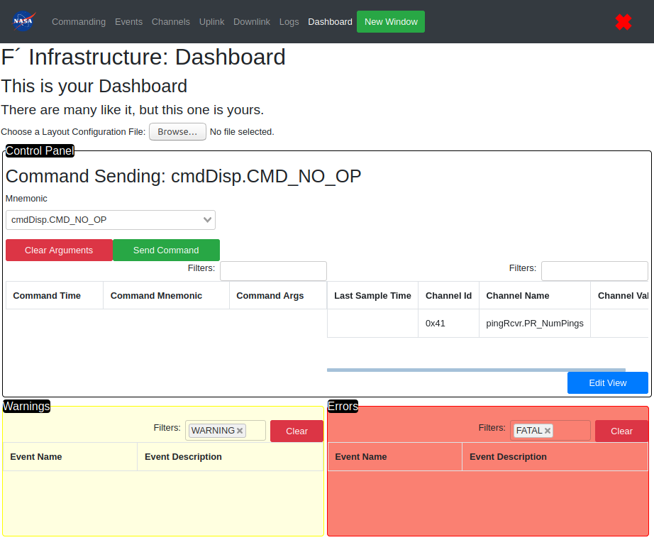
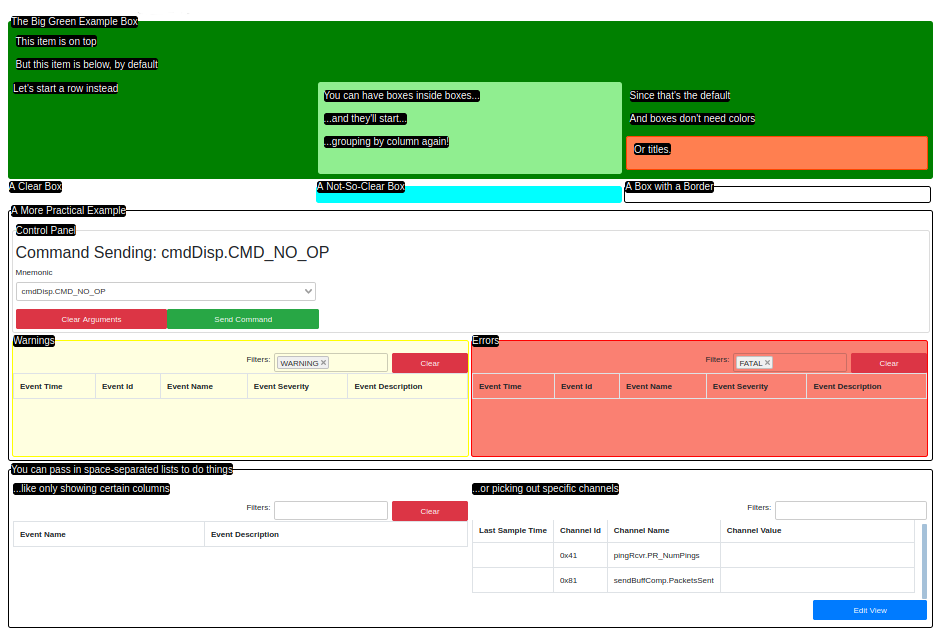

# The GDS Dashboard

## *There are many like it, but this one is yours*



The GDS Dashboard lets users create a customizable menu for interacting with the GDS, choosing their own components and modifying them to suit their needs. Currently, there are 7 components to choose from:

-   `dashboard-box` groups components together visually
-   `dashboard-row` helps organize components horizontally
-   `command-input` sends selected commands to the spacecraft
-   `command-history` displays previously-sent commands
-   `event-list` displays events the GDS receives
-   `channel-table` displays telemetry data from the spacecraft
-   `logging` displays logged messages stored as the GDS runs

Users can design their own dashboard by specifying the components and settings they want in an XML configuration file, then uploading their file to the F' GDS GUI's Dashboard page. Once uploaded, the Dashboard should load the configuration file and create a GUI as long as the XML doesn't contain any errors.

- [The GDS Dashboard](#the-gds-dashboard)
    - [How to Use the Dashboard](#how-to-use-the-dashboard)
    - [How Layouts Work](#how-layouts-work)
    - [Customizing Components](#customizing-components)
    - [An Example Dashboard Configuration](#an-example-dashboard-configuration)

- [Dashboard Component Reference](#dashboard-component-reference)
    - [Dashboard-Specific Components](#dashboard-specific-components)
        - [dashboard-box](#dashboard-box)
        - [dashboard-row](#dashboard-row)
    - [Functional Components](#functional-components)
        - [command-input](#command-input)
        - [command-history](#command-history)
        - [event-list](#event-list)
        - [channel-table](#channel-table)
        - [logging](#logging)

## How to Use the Dashboard

1.  Start running the GDS GUI for your application by running `fprime-gds` in your deployment folder
2.  Navigate to the "Dashboard" tab
3.  Click "Browse" and select the XML configuration file containing your dashboard setup
4.  The new Dashboard should load correctly from your file

The browser will save your most recently-used Dashboard configuration and use it automatically when you restart the GUI. At any point, you can upload a new configuration file to change your Dashboard.

## How Layouts Work

-   Unless elements are inside a `dashboard-row`, they'll default to stacking in a column layout, top to bottom, and taking up 100% of the page's width.
-   Elements inside a `dashboard-row` will instead stack horizontally, left to right.
    -   If there are multiple elements inside a `dashboard-row`, each element in the row will be equally wide (e.g. if there are 4 elements in a row, each will take up 25% of the page's width).
-   `dashboard-box` and `dashboard-row` will grow to contain all the elements inside them, but won't exceed the maximum width they can have for the row they're in; all other elements have a fixed height and variable width. If an element is inside a box that's too small for it, a scrollbar will appear to let users see the rest of the element.
-   Elements will stay in the same row regardless of the page size (there isn't any "wrapping"), and will always maintain the relative ordering they were specified in.

## Customizing Components

You can customize individual components by passing in properties to them in the form of XML attributes. There are 2 general kinds of properties:

-   *Normal properties* are given as a single string value.

    ```xml
    <dashboard-box title="A Giant Blob of Data">
    (...)
    ```

-   *List properties* are given as a series of space-separated values in a single string, which are then taken in as a list of strings. Strings that should be composed of multiple words should be enclosed in single quotes.

    ```xml
    <channel-table fields="Description 'Channel Value' 'Channel Name'">
    ```

Each component type has different properties that can be used to customize it. All properties for components are completely optional; omitted properties will use a default value.

## An Example Dashboard Configuration

```xml
<dashboard-box title="The Big Green Example Box" color="green">
    <dashboard-box title="This item is on top"/>
    <dashboard-box title="But this item is below, by default"/>
    <dashboard-row>
        <dashboard-box title="Let's start a row instead"/>
        <dashboard-box color="lightgreen">
            <dashboard-box title="You can have boxes inside boxes..."/>
            <dashboard-box title="...and they'll start..."/>
            <dashboard-box title="...grouping by column again!"/>
        </dashboard-box>
        <dashboard-box>
            <dashboard-box title="Since that's the default"/>
            <dashboard-box title="And boxes don't need colors"/>
            <dashboard-box color="coral" border-color="orangered">
                <dashboard-box title="Or titles."/>
            </dashboard-box>
        </dashboard-box>
    </dashboard-row>
</dashboard-box>

<dashboard-row>
    <dashboard-box title="A Clear Box"/>
    <dashboard-box title="A Not-So-Clear Box" color="aqua"/>
    <dashboard-box title="A Box with a Border" border-color="black"/>
</dashboard-row>

<dashboard-box title="A More Practical Example" border-color="black">
    <dashboard-box title="Control Panel" border-color="gainsboro">
        <command-input/>
    </dashboard-box>

    <dashboard-row>
        <dashboard-box title="Warnings" color="lightyellow" border-color="yellow">
            <event-list filter-text="WARNING"/>
        </dashboard-box>
        <dashboard-box title="Errors" color="salmon" border-color="red">
            <event-list filter-text="FATAL"/>
        </dashboard-box>
    </dashboard-row>
</dashboard-box>

<dashboard-box title="You can pass in space-separated lists to do things" border-color="black">
    <dashboard-row>
        <dashboard-box title="...like only showing certain columns">
            <event-list fields="'Event Name' 'Event Description'"/>
        </dashboard-box>
        <dashboard-box title="...or picking out specific channels">
            <channel-table items-shown="pingRcvr.PR_NumPings sendBuffComp.PacketsSent"/>
        </dashboard-box>
    </dashboard-row>
</dashboard-box>
```

Saved in an XML file and given to the Dashboard, this will generate the following GUI:



--------------------------------------------------------------------------------

# Dashboard Component Reference

## Dashboard-Specific Components

There are currently 2 dashboard-specific components, which help users organize their dashboard but don't provide any actual functionality. A few overall notes:

-   Any colors given must be be either a hex code or a [named CSS color](https://www.w3.org/wiki/CSS/Properties/color/keywords)
-   By default, the components themselves are invisible without properties being set

### dashboard-box

```xml
<dashboard-box title="A Box!" color="gray" border-color="black">
    <!-- ...other content goes inside... -->
</dashboard-box>
```

The `dashboard-box` acts like a container that other elements are put inside, helping to visually group items together.

#### Properties

-   `title`: A text label to give the box, appearing at the top-left corner (defaults to nothing)
-   `color`: The background color to give the box (defaults to transparent)
-   `border-color`: The color to give the border of the box (defaults to transparent)

### dashboard-row

```xml
<dashboard-row>
    <!-- ...other content goes inside... -->
</dashboard-row>
```

Elements inside a `dashboard-row` will stack horizontally from left-to-right, instead of vertically. The container itself is invisible.

#### Properties

*N/A*

## Functional Components

### command-input

```xml
<command-input/>
```

Provides a selectable, searchable list of commands to send to the spacecraft and an interface for executing each command.

#### Properties

*N/A*

### command-history

```xml
<command-history
    fields="'Command Time' 'Command Id' 'Command Mnemonic' 'Command Args'"
    filter-text="cmdDisp"
    items-shown="cmdDisp.CMD_NO_OP health.HLTH_CHNG_PING"
    compact/>
```

Shows all previously-run commands with their time of being sent, name, and given arguments.

#### Properties

-   `fields`: A list of columns to *show* on the data table, with the rest hidden; the given column names must be an exact match (defaults to showing all columns)
-   `filter-text`: The single string to include as an initial filter for the history; any history items that don't contain the filter text are hidden (defaults to no filter)
-   `items-shown`: A list of command type names (i.e. Command Mnemonics) to *show* on the data table, with the rest hidden; the given command types must be an exact match (defaults to showing all commands)
-   `compact`: When added as a flag, shows only the data table for this component and hides any other buttons, filters, or headers

### event-list

```xml
<event-list
    fields="'Event Time' 'Event Id' 'Event Name' 'Event Severity' 'Event Description'"
    filter-text="WARNING_LO"
    items-shown=""
    compact/>
```

Shows all the events the GDS has received from the spacecraft.

#### Properties

-   `fields`: See the `fields` property on [command-history](#command-history)
-   `filter-text`: See the `filter-text` property on [command-history](#command-history)
-   `items-shown`: A list of event name types to display; see the `items-shown` property on [command-history](#command-history) for details on how this works
-   `compact`: See the `compact` property on [command-history](#command-history)

### channel-table

```xml
<channel-table
    fields="'Last Sample Time' 'Channel Id' 'Channel Name' 'Event Severity' 'Event Description'"
    filter-text="WARNING_LO"
    items-shown=""
    compact/>
```

Displays telemetry data the GDS has received from the spacecraft.

#### Properties

-   `fields`: See the `fields` property on [command-history](#command-history)
-   `filter-text`: See the `filter-text` property on [command-history](#command-history)
-   `items-shown`: A list of channel names to display; see the `items-shown` property on [command-history](#command-history) for details on how this works
-   `compact`: See the `compact` property on [command-history](#command-history)

### logging

```xml
<logging/>
```

Provides a list of available log files for the current GDS run, and displays the text content of the selected file.

#### Properties

*N/A*
